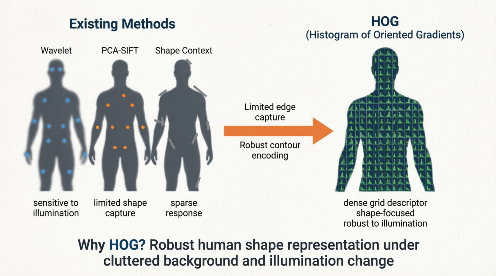
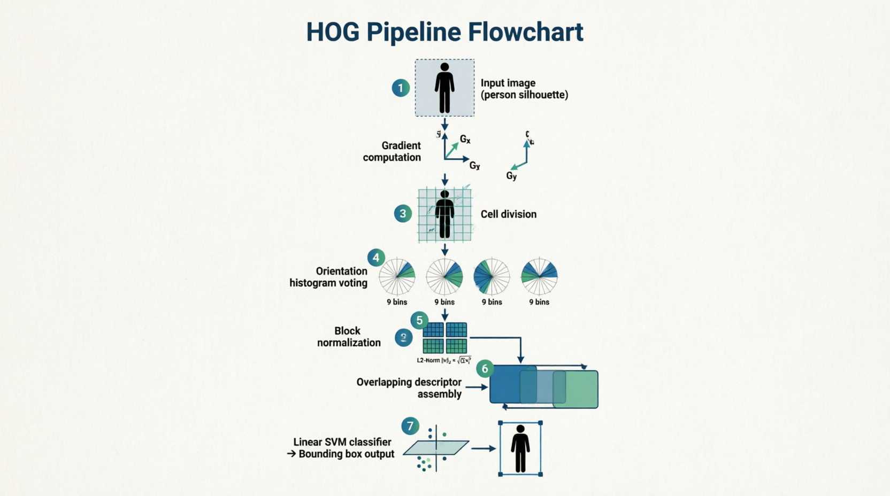
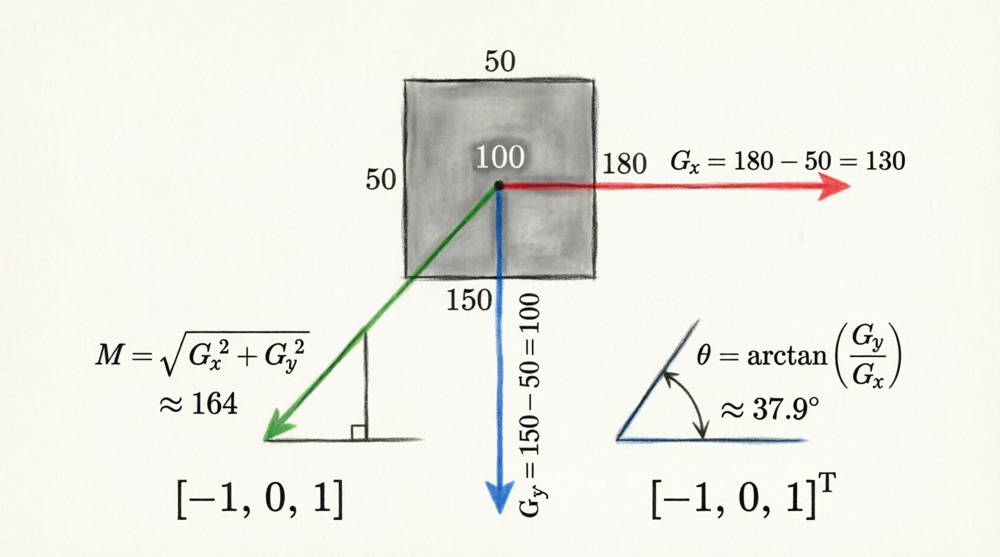
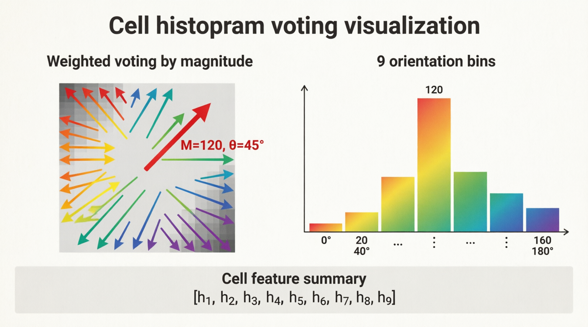
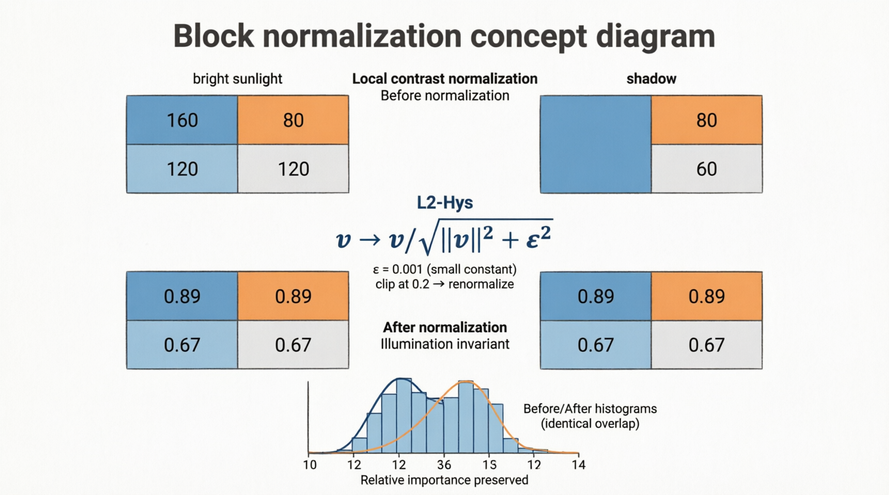
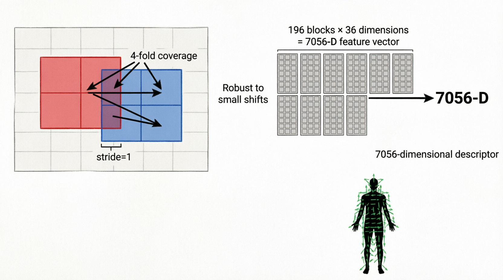
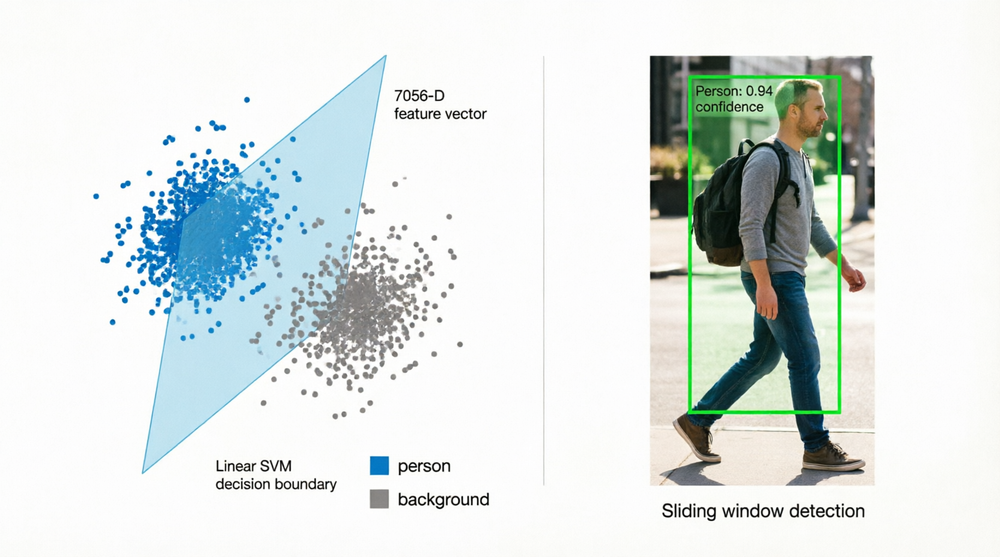
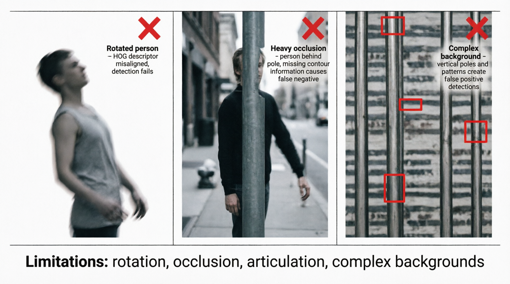

# HOG (Histograms of Oriented Gradients)

## 1. 한 줄 요약

HOG는 **이미지를 국소적인 gradient 방향 분포로 바꿔 표현하고, 이를 block 단위로 정규화한 뒤 SVM으로 분류하는 보행자 검출 기법**이다.  
핵심은 색이나 절대 밝기보다 **사람의 윤곽과 형태를 안정적으로 표현하는 방향성 edge 정보**에 집중한다는 점이다.

---

## 2. Why: 왜 HOG가 필요했는가

### 2.1 문제 배경

Dalal and Triggs(2005)가 다룬 핵심 문제는 **복잡한 배경과 조명 변화 속에서도 사람을 안정적으로 검출하는 것**이었다.

기존 보행자 검출은 다음 이유로 쉽게 무너졌다.

- 사람의 자세(pose)가 계속 바뀐다.
- 배경이 복잡하고 clutter가 심하다.
- 조명과 contrast가 크게 달라진다.
- 단순 template matching은 형태 변화에 약하다.

논문이 던진 질문은 명확하다.

> **사람처럼 형태 정보가 중요한 객체를, 배경과 조명 변화에 덜 흔들리면서 안정적으로 표현할 수 있는 feature는 무엇인가?**

### 2.2 기존 방법의 한계

논문은 HOG를 다음 계열 방법과 비교한다.

- Haar / Wavelet 기반 방법
- PCA-SIFT 기반 방법
- Shape Context 기반 방법
- Edge image + exemplar matching 방식

이들의 공통 한계는 다음으로 정리할 수 있다.

1. **조명 변화에 취약했다.**
   - 절대 intensity나 약한 edge contrast에 의존하면 illumination 변화에 흔들린다.

2. **사람의 shape를 충분히 안정적으로 표현하지 못했다.**
   - 보행자 검출은 texture보다 실루엣과 윤곽이 중요하다.

3. **sparse 또는 약한 구조의 표현은 사람처럼 길고 연속적인 객체에 불리했다.**
   - 신뢰할 만한 keypoint가 항상 잘 잡히지 않았다.

결국 HOG의 motivation은 한 문장으로 정리된다.

> **기존 feature들은 복잡한 배경과 조명 변화 속에서 사람의 shape를 안정적으로 표현하지 못했기 때문에, 조명에 강하고 형태 중심적인 dense descriptor가 필요했다.**



---

## 3. How: 핵심 파이프라인

HOG의 전체 흐름은 다음과 같다.

```text
Input Image
→ Gradient Computation
→ Cell Histogram Voting
→ Block Normalization
→ Overlapping Descriptor Assembly
→ Sliding Window + Linear SVM
→ Bounding Box Output
```

이 한 줄 플로우를 머릿속에 그릴 수 있어야 HOG를 이해한 것이다.



---

## 4. 입력 데이터와 초기 표현

HOG의 입력은 보통 하나의 detection window에 해당하는 이미지 패치다.  
네 정리 기준 예시는 `120 × 120` grayscale 이미지다.

- 입력 크기: `120 × 120`
- 총 픽셀 수: `14,400`
- 픽셀 값 범위: `0 ~ 255`

이 단계에서 중요한 점은 HOG가 이미지를 색상 정보가 아니라 **숫자 격자(raster)** 로 본다는 것이다.  
그 다음 이 숫자 격자에서 **밝기 변화의 방향과 크기**를 뽑아낸다.

예를 들어,

```text
[50, 50, 180, 180, ...]
```

같은 값 배열이 있으면, 왼쪽과 오른쪽의 차이를 통해 edge가 있는지, 있다면 어느 방향인지 계산할 수 있다.

> 사진: Raw Data 시각화  
> 현재 그림은 교체 필요. grayscale 픽셀 값은 반드시 `0~255` 범위 안에 있어야 하며, 확대된 `8×8` patch가 숫자 행렬로 자연스럽게 연결되어야 한다.

---

## 5. Step 1: Gradient 계산

### 5.1 핵심 아이디어

HOG는 픽셀 값 자체보다 **밝기 변화의 방향과 세기**를 사용한다.

즉,

- 어디가 밝은지보다
- 어디에서 밝기가 급격히 바뀌는지
- 그 변화가 어느 방향으로 일어나는지가 중요하다.

### 5.2 계산식

논문의 기본 설정은 단순한 중앙 차분 필터를 쓴다.

```text
Gx = I(x+1, y) - I(x-1, y)
Gy = I(x, y+1) - I(x, y-1)
```

필터 표현으로 쓰면 다음과 같다.

```text
Horizontal filter: [-1, 0, 1]
Vertical filter:   [-1, 0, 1]^T
```

### 5.3 Magnitude와 Orientation

각 픽셀에 대해 다음 값을 계산한다.

```text
Magnitude:   M = sqrt(Gx^2 + Gy^2)
Orientation: θ = atan2(Gy, Gx)
```

- `M`은 edge의 강도다.
- `θ`는 edge의 방향이다.

### 5.4 왜 이렇게 단순하게 계산하는가

논문의 핵심 결론 중 하나는 다음이다.

> **gradient는 가능한 한 fine scale에서 계산하는 편이 좋고, 사전 smoothing은 성능을 떨어뜨린다.**

즉 blur로 노이즈를 줄이기보다, **미세한 contour 정보를 그대로 유지하는 것이 사람 검출에는 더 유리했다.**



---

## 6. Step 2: Cell Histogram Voting

### 6.1 Cell이란 무엇인가

gradient를 픽셀 단위로 그대로 쓰지 않고, 작은 공간 단위로 묶어서 histogram을 만든다.

기본 설정:

- cell 크기: `8 × 8 pixels`

즉 cell 하나는 64개의 픽셀을 포함한다.

### 6.2 Orientation binning

각 픽셀의 방향은 orientation bin에 누적된다.

논문의 대표 설정:

- orientation range: `0° ~ 180°` (unsigned gradient)
- bin 개수: `9`
- bin 폭: `20°`

### 6.3 Weighted voting

각 픽셀은 단순히 1표를 던지는 것이 아니라, **gradient magnitude를 가중치로 사용해 투표**한다.

예를 들어,

- `θ = 45°`
- `M = 120`

이면 해당 orientation bin에 `120`이 누적된다.

즉 강한 edge가 약한 edge보다 더 큰 영향을 갖는다.

### 6.4 결과

cell 하나는 최종적으로 9차원 벡터가 된다.

```text
[h1, h2, h3, ..., h9]
```

이 벡터는 해당 지역에서 **어느 방향의 edge가 얼마나 많이 나타나는지**를 요약한다.



---

## 7. Step 3: Block Normalization

### 7.1 왜 normalization이 필요한가

같은 사람이라도 햇빛 아래와 그늘 아래에서는 gradient magnitude의 절대값이 크게 달라질 수 있다.  
이 값을 그대로 쓰면 같은 shape도 다른 feature로 보일 수 있다.

그래서 HOG는 인접한 cell들을 묶은 block 단위에서 histogram을 정규화한다.

### 7.2 기본 block 구성

대표 설정:

- block 크기: `2 × 2 cells`

cell 하나가 9차원이므로 block 하나는

```text
2 × 2 × 9 = 36 dimensions
```

가 된다.

### 7.3 논문에서 중요한 결론

논문은 여러 normalization 방식을 비교했다.

- L2-norm
- L2-Hys
- L1-norm
- L1-sqrt
- no normalization

여기서 핵심은 다음 두 가지다.

1. **정규화 자체가 필수다.**
2. **L2-Hys 계열이 매우 강력하다.**

정규화를 제거하면 miss rate가 크게 악화된다.

### 7.4 L2-Hys

논문의 대표 설정은 `L2-Hys`다.

개념적으로는 다음 순서다.

```text
36-D block vector
→ L2 normalize
→ large values clipping
→ renormalize
```

이 과정은 조명이나 지역 contrast 차이보다 **상대적인 edge 패턴**이 더 잘 드러나게 만든다.



---

## 8. Step 4: Block Overlap과 Final Descriptor

### 8.1 왜 overlap을 쓰는가

block을 겹치게(sliding) 만들면 하나의 cell이 여러 번 정규화에 참여한다.  
이 중복은 단순 redundancy가 아니라 **로컬 contrast 변화에 대한 강건성**을 높이는 핵심 요소다.

논문에서도 overlapping block normalization이 성능 향상에 중요하다고 보고한다.

### 8.2 네 예시 기준 계산

입력: `120 × 120`

1. cell 크기: `8 × 8`  
   → cell grid는 `15 × 15`

2. block 크기: `2 × 2 cells`

3. stride: `1 cell`

4. 가능한 block 개수:

```text
(15 - 2 + 1) × (15 - 2 + 1) = 14 × 14 = 196 blocks
```

5. 각 block descriptor 차원:

```text
2 × 2 × 9 = 36 dimensions
```

6. 최종 descriptor 차원:

```text
196 × 36 = 7056 dimensions
```

즉 `120 × 120` 이미지 한 장은 최종적으로 **7056차원 벡터**로 바뀐다.

### 8.3 원 논문의 기본 검출기와 차이

Dalal and Triggs의 기본 detection window는 `64 × 128`이다.  
이 설정에서는 최종 descriptor가 **3780차원**이 된다.

즉,

- `120 × 120 → 7056차원`은 네 설명용 예시
- `64 × 128 → 3780차원`은 논문 기본 설정

으로 구분해서 말해야 한다.



---

## 9. Step 5: SVM Classification

최종적으로 HOG descriptor는 고차원 feature vector가 된다.  
이 벡터를 **Linear SVM**에 넣어 사람 / 비사람(background)을 분류한다.

검출 과정은 보통 다음과 같다.

1. 이미지 위를 sliding window로 훑는다.
2. 각 window마다 HOG descriptor를 만든다.
3. Linear SVM score를 계산한다.
4. score가 threshold를 넘으면 사람 후보로 판단한다.
5. 최종적으로 bounding box를 출력한다.

이때 HOG 자체는 descriptor이고, **최종 판정은 SVM이 수행한다.**



---

## 10. Hyperparameter와 Ablation Study

이 부분은 "왜 8×8 cell이고, 왜 9 bins이고, 왜 `[-1, 0, 1]` 필터인가?"에 답해야 한다.

### 10.1 Gradient filter

논문은 단순한 `[-1, 0, 1]` 필터가 가장 좋다고 보고한다.

이유는 다음과 같다.

- 미세한 contour를 보존한다.
- 사전 smoothing보다 fine-scale edge가 더 중요했다.
- 지나친 blur는 discriminative shape 정보를 잃게 만든다.

### 10.2 Orientation bins

논문 Figure 4 기준으로 **9 bins 부근이 최적**이다.

- 너무 적으면 방향 정보가 뭉개진다.
- 너무 많으면 histogram이 희소해지고 noise에 민감해진다.

즉 9 bins는 **표현력과 안정성의 균형점**이다.

### 10.3 Cell size

논문 결과를 요약하면 **대체로 6~8 pixel 폭의 cell이 가장 유리**하다.

- cell이 너무 크면 local shape가 뭉개진다.
- cell이 너무 작으면 노이즈에 민감해진다.

실무적으로는 `8×8`이 많이 쓰이고, 논문에서도 강력한 기본 설정이다.

### 10.4 Block size

논문 Figure 5에서는 `3×3 blocks of 6×6 cells`가 가장 낮은 miss rate를 보이는 지점이 있다.  
하지만 대표 기본 설정으로는 `2×2 blocks of 8×8 cells`가 널리 사용된다.

즉 여기서 구분이 필요하다.

- **paper best point**: 일부 실험 조건에서 `6×6 cell + 3×3 block`
- **대표 기본 설정 / 실무 설명용**: `8×8 cell + 2×2 block`

이 둘을 섞어서 말하면 안 된다.

### 10.5 Overlap

block overlap은 성능 향상에 매우 중요하다.

- overlap이 없으면 local contrast 변화에 약해진다.
- overlap이 있으면 하나의 cell이 여러 normalization 문맥에서 표현된다.

논문은 overlap이 miss rate를 유의미하게 줄인다고 보였다.

> 사진: Figure 4 / Figure 5 요약용 그래프  
> 현재 그림은 교체 필요. `논문 실험상 best point`와 `대표 기본 설정`을 분리해서 다시 그려야 한다.

---

## 11. Trade-off: 무엇을 얻고 무엇을 포기했는가

HOG의 장점은 분명하다.

- 조명 변화에 강하다.
- shape / contour 표현력이 좋다.
- 보행자처럼 윤곽이 중요한 객체에 강하다.
- linear SVM과 결합해도 매우 좋은 성능을 낸다.

대신 다음을 포기한다.

- texture나 semantic 의미 자체는 거의 쓰지 않는다.
- 회전 불변성이 강하지 않다.
- large deformation에 약하다.
- dense descriptor라 계산량이 적지 않다.

즉 HOG는 **shape robustness를 얻기 위해 semantic flexibility와 invariance 일부를 포기한 기법**이다.

---

## 12. Limit: 어디서 실패하는가

HOG는 강력하지만 완전하지 않다.

대표적인 실패 조건은 다음과 같다.

- **회전된 객체**
  - orientation histogram은 회전에 민감하다.

- **심한 가림(occlusion)**
  - 사람 실루엣이 크게 끊기면 shape descriptor가 무너진다.

- **복잡한 배경**
  - 사람과 유사한 edge 구조가 많으면 false positive가 늘 수 있다.

- **비정형 포즈 / articulation**
  - 고정된 템플릿 형태의 sliding window는 자세 변화가 큰 경우 불리하다.

즉 HOG는 실루엣 기반 검출에 매우 강하지만, **회전·가림·자세 변형에 대한 강한 불변성은 부족하다.**



---

## 13. DET Curve 해석

논문은 성능 평가에 DET curve를 사용한다.

- x축: `False Positives Per Window (FPPW)`
- y축: `Miss Rate`
- 보통 log-log 축
- **왼쪽 아래로 갈수록 성능이 좋다**

이 그래프는 단순 accuracy보다 훨씬 중요하다.  
왜냐하면 보행자 검출은 **오검출(false positive)과 미검출(miss)의 trade-off**를 같이 봐야 하기 때문이다.

논문 결과에서 HOG는 비교 대상들보다 더 낮은 miss rate와 더 낮은 false positive를 동시에 달성했다.  
특히 동일 miss rate 기준에서 false positive가 **한 자릿수 이상 낮아지는 구간**이 있었다.

> 사진: DET curve 해석 그림  
> 현재 그림은 교체 필요. HOG 곡선이 반드시 더 낮고 더 왼쪽에 위치하도록 다시 그려야 한다.

---

## 14. 발표/면접에서 바로 답해야 하는 질문

### 14.1 Why에 대한 답

> 기존 wavelet, PCA-SIFT, shape context 계열은 조명 변화와 복잡한 배경에서 사람의 형태를 안정적으로 표현하지 못했다.  
> 그래서 Dalal and Triggs는 색이나 절대 밝기보다 gradient 방향 분포를 dense하게 모아 사람의 실루엣을 표현하는 HOG를 제안했다.

### 14.2 How에 대한 답

> 입력 이미지를 gradient로 바꾸고, 이를 cell histogram으로 요약한 다음, block 단위로 정규화하고, overlapping descriptor를 조립해서 linear SVM으로 판정한다.

### 14.3 Hyperparameter에 대한 답

> 논문 실험 결과를 보면 `[-1, 0, 1]` 필터가 fine-scale edge를 가장 잘 살렸고, 9 orientation bins가 방향 정보와 안정성의 균형이 좋았으며, 6~8 pixel 수준의 cell과 overlap block normalization이 가장 유리했다.

### 14.4 Trade-off와 Limit에 대한 답

> HOG는 조명 변화에 강하고 사람 실루엣을 잘 찾지만, 회전·가림·비정형 포즈에는 약하고, deep feature처럼 semantic invariant representation은 제공하지 못한다.

---

## 15. 한 장 요약

### 15.1 핵심 문장

> **HOG는 사람 검출을 위해, 이미지를 gradient 방향 분포로 바꿔 shape 중심 descriptor를 만들고, block normalization으로 조명 변화에 강인하게 만든 뒤, linear SVM으로 분류하는 방법이다.**

### 15.2 기억해야 할 숫자

- gradient filter: `[-1, 0, 1]`
- orientation bins: `9`
- 대표 cell size: `8×8`
- 대표 block size: `2×2 cells`
- 대표 classifier: `Linear SVM`
- 논문 기본 detection window: `64×128`
- 논문 기본 descriptor 차원: `3780`
- 예시 입력 `120×120`의 descriptor 차원: `7056`

### 15.3 기억해야 할 논문 메시지

- fine-scale gradient가 중요하다.
- orientation histogram은 shape를 잘 표현한다.
- local contrast normalization은 필수다.
- overlapping block structure가 성능 향상에 중요하다.
- HOG는 당시 보행자 검출에서 기존 방법보다 큰 폭의 성능 향상을 보였다.

---

## 16. 참고

- Navneet Dalal, Bill Triggs, **Histograms of Oriented Gradients for Human Detection**, CVPR 2005
- 본 문서는 `Dalal and Triggs (2005)` 논문과 개인 정리 문서를 바탕으로 재구성함
